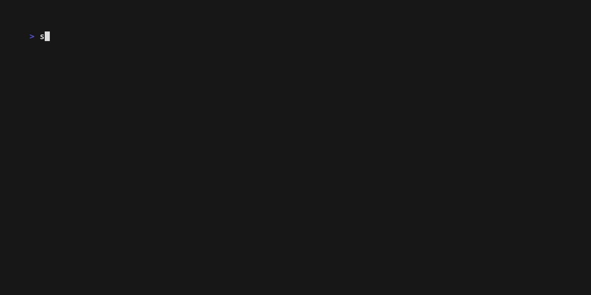

<!-- markdownlint-disable MD033 MD041 MD036 -->

# Signer

[![Crates.io][crates-badge]][crates-url]
[![Docs.rs][docs-badge]][docs-url]
[![CI][ci-badge]][ci-url]
[![License][license-badge]][license-url]
[![Rust][rust-badge]][rust-url]

[crates-badge]: https://img.shields.io/crates/v/signer.svg
[crates-url]: https://crates.io/crates/signer
[docs-badge]: https://img.shields.io/docsrs/signer.svg
[docs-url]: https://docs.rs/signer
[ci-badge]: https://github.com/qntx/signer/actions/workflows/rust.yml/badge.svg
[ci-url]: https://github.com/qntx/signer/actions/workflows/rust.yml
[license-badge]: https://img.shields.io/badge/license-MIT%2FApache--2.0-blue.svg
[license-url]: LICENSE-MIT
[rust-badge]: https://img.shields.io/badge/rust-edition%202024-orange.svg
[rust-url]: https://doc.rust-lang.org/edition-guide/

**Lightweight multi-chain transaction signer — 9 chains, zero hand-rolled crypto, and a batteries-included CLI.**

Signer provides thin, secure wrappers around battle-tested cryptographic libraries ([k256](https://docs.rs/k256) for secp256k1, [ed25519-dalek](https://docs.rs/ed25519-dalek) for Ed25519), exposing a unified `Sign` trait across Bitcoin, Ethereum, Solana, Cosmos, Tron, Sui, TON, Filecoin, and Spark. Private keys are zeroed on drop, `Debug` output is redacted, and `Clone` is intentionally omitted. Optional [kobe](https://github.com/qntx/kobe) integration enables seamless HD wallet bridging.

<p align="center">
  
</p>

## Quick Start

### Install the CLI

**Shell** (macOS / Linux):

```sh
curl -fsSL https://sh.qntx.fun/signer | sh
```

**PowerShell** (Windows):

```powershell
irm https://sh.qntx.fun/signer/ps | iex
```

Or via Cargo:

```bash
cargo install signer-cli
```

### CLI Usage

```bash
# Ethereum — EIP-191 personal_sign
signer evm sign-message -k "0x4c0883a6..." -m "Hello, Ethereum!"

# Bitcoin — message signing
signer btc sign-message -k "4c0883a6..." -m "Hello, Bitcoin!"

# Solana — Ed25519
signer svm sign -k "9d61b19d..." -m "Hello, Solana!"

# Sui — BLAKE2b intent signing
signer sui sign-tx -k "9d61b19d..." -t "0000..."

# Show address / public key
signer evm address -k "0x4c0883a6..."

# JSON output (for scripts / agents)
signer --json evm sign-message -k "0x4c0883a6..." -m "test"
```

### Library Usage

```rust
use signer_evm::Signer;

let signer = Signer::from_hex("4c0883a69102937d6231471b5dbb6204fe5129617082792ae468d01a3f362318")?;
let out = signer.sign_message(b"hello")?;

println!("Address:   {}", signer.address());
println!("Signature: {}", hex::encode(&out.signature));
```

```rust
use signer_svm::Signer;
use ed25519_dalek::Signer as _;

let signer = Signer::random();
let sig = signer.sign(b"hello solana");
signer.verify(b"hello solana", &sig)?;

println!("Address: {}", signer.address());
```

### Kobe HD Wallet Integration

Enable the `kobe` feature to construct signers from [kobe](https://github.com/qntx/kobe) derived keys:

```rust
use kobe::Wallet;
use kobe_evm::Deriver;
use signer_evm::Signer;

let wallet = Wallet::from_mnemonic("abandon abandon ... about", None)?;
let derived = Deriver::new(&wallet).derive(0)?;
let signer = Signer::from_derived(&derived)?;
println!("Address: {}", signer.address());
```

## Design

- **9 chains** — Ethereum, Bitcoin, Solana, Cosmos, Tron, Sui, TON, Filecoin, Spark
- **Zero hand-rolled crypto** — secp256k1 via [k256](https://docs.rs/k256), Ed25519 via [ed25519-dalek](https://docs.rs/ed25519-dalek)
- **Unified trait** — `Sign` trait with `sign_hash`, `sign_message`, `sign_transaction` across all chains
- **Security hardened** — `ZeroizeOnDrop`, `Debug` redacted (`[REDACTED]`), `Clone` removed, `Send + Sync`
- **Kobe integration** — Optional HD wallet bridging via `kobe` feature flag
- **CSPRNG** — Random generation via OS-provided entropy ([`getrandom`](https://docs.rs/getrandom))
- **KAT-verified** — Deterministic test vectors (RFC 8032, known secp256k1 keys) for all chains
- **Strict linting** — Clippy `pedantic` + `nursery` + `correctness` (deny), zero warnings
- **Edition** — Rust **2024**

## Crates

See **[`crates/README.md`](crates/README.md)** for the full crate table, dependency graph, and feature flag reference.

## Security

This library has **not** been independently audited. Use at your own risk.

- Private keys wrapped in [`ZeroizeOnDrop`](https://docs.rs/zeroize) — zeroed from memory on drop
- `Debug` impl outputs `[REDACTED]` — no key material leaked to logs
- `Clone` intentionally removed — prevents uncontrolled key copies
- Random generation uses OS-provided CSPRNG via [`getrandom`](https://docs.rs/getrandom)
- `Sign` trait requires `Send + Sync` — safe for concurrent use
- No key material is logged or persisted

## License

Licensed under either of:

- Apache License, Version 2.0 ([LICENSE-APACHE](LICENSE-APACHE) or <https://www.apache.org/licenses/LICENSE-2.0>)
- MIT License ([LICENSE-MIT](LICENSE-MIT) or <https://opensource.org/licenses/MIT>)

at your option.

Unless you explicitly state otherwise, any contribution intentionally submitted for inclusion in this project shall be dual-licensed as above, without any additional terms or conditions.

---

<div align="center">

A **[QNTX](https://qntx.fun)** open-source project.

<a href="https://qntx.fun"></a>

<!--prettier-ignore-->
Code is law. We write both.

</div>
