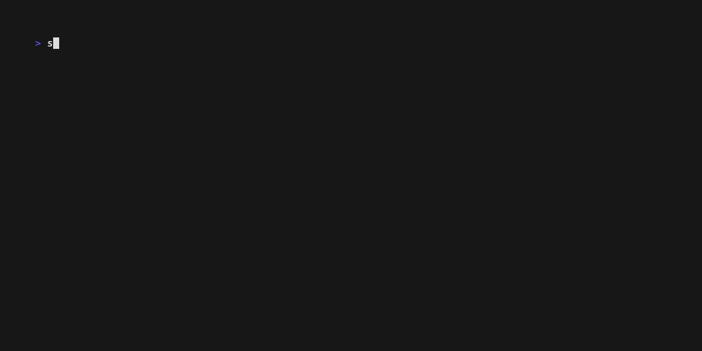

# Signer

[![Crates.io][crates-badge]][crates-url]
[![Docs.rs][docs-badge]][docs-url]
[![CI][ci-badge]][ci-url]
[![License][license-badge]][license-url]
[![Rust][rust-badge]][rust-url]

[crates-badge]: https://img.shields.io/crates/v/signer.svg
[crates-url]: https://crates.io/crates/signer
[docs-badge]: https://img.shields.io/docsrs/signer.svg
[docs-url]: https://docs.rs/signer
[ci-badge]: https://github.com/qntx/signer/actions/workflows/ci.yml/badge.svg
[ci-url]: https://github.com/qntx/signer/actions/workflows/ci.yml
[license-badge]: https://img.shields.io/badge/license-MIT%2FApache--2.0-blue.svg
[license-url]: LICENSE-MIT
[rust-badge]: https://img.shields.io/badge/rust-edition%202024-orange.svg
[rust-url]: https://doc.rust-lang.org/edition-guide/

**`no_std`-compatible Rust toolkit for multi-chain transaction signing — thirteen networks, zero hand-written cryptography, cross-implementation KATs.**

Signer turns 32-byte private keys into standards-compliant signatures for Aptos, Bitcoin, Ethereum, Solana, Cosmos, Tron, Sui, TON, Filecoin, Spark, XRP Ledger, Nostr, and Casper. It layers thin wrappers around [`k256`](https://docs.rs/k256) (secp256k1 ECDSA and BIP-340 Schnorr) and [`ed25519-dalek`](https://docs.rs/ed25519-dalek) on a capability-split trait surface (`SignDigest`, optional `SignMessage`, chain-inherent `sign_transaction`); every library crate builds under `no_std + alloc`, private keys wrap in `Zeroizing` / `ZeroizeOnDrop` and redact in `Debug`, and chain outputs are pinned against independent references (RFC 6979 / 8032, BIP-137 / 340, EIP-191 / 712, `@noble/curves`, …).

> **See also** [`kobe`](https://github.com/qntx/kobe) — the companion HD-wallet derivation toolkit that feeds `Signer::from_derived` with BIP-39 / BIP-32 / SLIP-10 accounts.

<p align="center">
  
</p>

## Quick Start

### Install the CLI

**Shell** (macOS / Linux):

```bash
curl -fsSL https://sh.qntx.fun/signer | sh
```

**PowerShell** (Windows):

```powershell
irm https://sh.qntx.fun/signer/ps | iex
```

Or via Cargo:

```bash
cargo install signer-cli
```

### CLI Usage

```bash
# Prefer stdin / file for keys on shared hosts (shell history / process listings)
echo "$KEY" | signer evm    sign-message -k - -m "Hello, Ethereum!"   # EIP-191
echo "$KEY" | signer btc    sign-message -k - -m "Hello, Bitcoin!"    # BIP-137
echo "$KEY" | signer sui    sign-tx      -k - -t "0000..."            # BLAKE2b intent
echo "$KEY" | signer cosmos sign-tx      -k - -t "<SignDoc hex>"      # ADR-036 input
echo "$KEY" | signer xrpl   sign-tx      -k - -t "<tx fields hex>"    # STX\0 + SHA-512/2 + DER
echo "$KEY" | signer nostr  sign-digest  -k - -x "5e6ea04f..."        # NIP-01 event id
echo "$KEY" | signer casper sign-digest  -k - -x "<32-byte deploy hash>" --algo secp256k1
signer      casper sign-digest -k @./key.hex -x "<digest>" --algo ed25519
signer      evm    address     -k @./key.hex                          # EIP-55 (this key only)

# Agent-friendly JSON (global flag before the chain subcommand)
signer --json evm sign-message -k - -m "test"

# Self-upgrade (sh.qntx.fun install path; same as re-running the install script)
signer upgrade              # install latest if newer (`update` is an alias)
signer upgrade --check      # report only
signer upgrade --force      # reinstall even when up to date
signer --json upgrade --check
```

CLI verbs match the library: **`sign-digest`**, **`sign-message`**, **`sign-tx`**, **`address`**. Chains without a canonical personal-message scheme omit `sign-message`. Private keys accept hex, `-` (stdin), or `@path`. JSON sign results include a stable `scheme` field (`ecdsa_recoverable`, `ed25519`, `schnorr`, …). Cargo installs under `.cargo/bin` are not overwritten; the command prints a `cargo install signer-cli --force` hint instead.

### Library Usage

```toml
# Default is `std` + `mainstream` (btc, evm, svm). Opt into more chains or presets explicitly.
signer = { version = "3", features = ["std", "mainstream"] }

# All chains
signer = { version = "3", features = ["std", "all-chains"] }

# Single chain + optional kobe HD bridge
signer = { version = "3", features = ["std", "evm", "kobe"] }
kobe   = { version = "3.2", features = ["std", "evm"] }
```

kobe may resolve **k256 0.13** while signer uses **k256 0.14**; the bridge is **32-byte secrets only**, not shared signing-key types. See [SECURITY.md](SECURITY.md) and [docs/KAT_MATRIX.md](docs/KAT_MATRIX.md).

```rust
use signer::evm::{SignDigest, SignMessage, Signer};

let signer = Signer::from_hex(
    "4c0883a69102937d6231471b5dbb6204fe5129617082792ae468d01a3f362318",
)?;

let raw = signer.sign_digest(&[0x42u8; 32])?; // v = 0 | 1  (raw parity → RLP)
let msg = signer.sign_message(b"hello")?;     // v = 27 | 28 (EIP-191)

println!("Address:   {}", signer.address());  // identity of this key only (not HD)
println!("Signature: {}", msg.to_hex());
println!("Scheme:    {}", msg.scheme());      // ecdsa_recoverable
```

`SignOutput` is a discriminated enum — `Ecdsa { signature, v }`, `EcdsaDer`, `Ed25519`, `Ed25519WithPubkey`, `Schnorr` — so callers pattern-match wire shape instead of juggling optional metadata. `v` semantics are documented per producer (raw parity, EIP-191, BIP-137 ranges); they **collide across chains**, so verifiers must already know the scheme.

Chains without a canonical off-chain message scheme do **not** implement `SignMessage`. Build the domain preimage externally and pass it to the chain’s inherent `sign_transaction` (not a shared trait — byte semantics differ by protocol):

```rust
// Cosmos: build ADR-036 StdSignDoc bytes externally (e.g. via kobe / app layer)
use signer::cosmos::Signer;

let signer = Signer::from_hex("4c0883a6...")?;
let signature = signer.sign_transaction(sign_doc_bytes)?;
```

Bitcoin message signing selects the BIP-137 header for the target address type; the default matches Bitcoin Core `signmessage` (compressed P2PKH):

```rust
use signer::btc::{BitcoinMessageAddressType, SignMessage, Signer};

let signer = Signer::from_hex("4c0883a6...")?;
let compressed = signer.sign_message(b"Hi")?; // v = 31 | 32
let bech32 = signer.sign_message_with(BitcoinMessageAddressType::SegwitBech32, b"Hi")?;
```

### Architecture

```text
L0  signer-primitives     curve engines + SignDigest / SignOutput / v_encoding
L1  signer-{chain}        protocol preimage + wire (EIP-191, BIP-137, intent, …)
L2  signer-cli            ops UX (sign-digest / sign-message / sign-tx)
──  kobe (companion)      HD only — FromDerived over 32-byte secret material
```

Two key materials (secp256k1 scalar, Ed25519 seed) and three schemes (ECDSA, BIP-340, Ed25519) cover all thirteen chains. **Framing is product value**, not noise: digests and headers are where multi-chain correctness lives.

### Kobe HD wallet integration

Enable the `kobe` feature to construct signers from [kobe](https://github.com/qntx/kobe) accounts:

```rust
use kobe::Wallet;
use kobe::evm::Deriver;
use signer::evm::{FromDerived, Signer};

let wallet = Wallet::from_mnemonic(
    "abandon abandon abandon abandon abandon abandon abandon abandon abandon abandon abandon about",
    None,
)?;
let account = Deriver::new(&wallet).derive(0)?;
let signer = Signer::from_derived(&account)?;
let sig = signer.sign_message(b"hello")?;
```

## Supported Chains

| Chain      | Crate           | Curve                 | Sighash / digest                 | Off-chain message                     |
| ---------- | --------------- | --------------------- | -------------------------------- | ------------------------------------- |
| Bitcoin    | `signer-btc`    | secp256k1             | double-SHA-256                   | BIP-137 (four header variants)        |
| Ethereum   | `signer-evm`    | secp256k1             | Keccak-256                       | EIP-191, EIP-712                      |
| Cosmos     | `signer-cosmos` | secp256k1             | SHA-256                          | ADR-036 `StdSignDoc` (external)       |
| Tron       | `signer-tron`   | secp256k1             | SHA-256 (`raw_data` txID)        | TRON prefix, wire `v = 27/28`         |
| Filecoin   | `signer-fil`    | secp256k1             | BLAKE2b-256 over CID bytes       | use `sign-tx` / digest                |
| Spark      | `signer-spark`  | secp256k1             | double-SHA-256                   | BIP-137 (compressed P2PKH)            |
| TON        | `signer-ton`    | Ed25519               | raw                              | caller-owned preimage                 |
| XRP Ledger | `signer-xrpl`   | secp256k1             | `STX\0` + SHA-512-half, DER      | none (no canonical personal-message)  |
| Solana     | `signer-svm`    | Ed25519               | raw                              | raw Ed25519 (`nacl.sign.detached`)    |
| Sui        | `signer-sui`    | Ed25519               | BLAKE2b-256 intent + BCS         | `PersonalMessage` intent              |
| Aptos      | `signer-aptos`  | Ed25519               | SHA3-256 domain + BCS            | use `sign-tx` / `sign_raw`            |
| Nostr      | `signer-nostr`  | Schnorr BIP-340       | SHA-256 (NIP-01 event id)        | raw BIP-340 (optional)                |
| Casper     | `signer-casper` | secp256k1 / Ed25519   | deploy digest (caller BLAKE2b)   | dual-curve digest / raw bytes         |

\* Address helpers on chain crates are **identity of this key only** (not multi-path HD). Full derivation lives in kobe.

## Design

- **13 chains** — Aptos, Bitcoin, Casper, Ethereum, Solana, Cosmos, Tron, Sui, TON, Filecoin, Spark, XRP Ledger, Nostr
- **Mature crypto dependencies** — `k256` for secp256k1 ECDSA and BIP-340 Schnorr, `ed25519-dalek` for Ed25519; hashing via `sha2` / `sha3` / `blake2` / `ripemd`; encoding via `bech32` / `bs58`
- **Capability-split traits** — mandatory `SignDigest::sign_digest` (`&[u8; 32]` → `SignOutput`); optional `SignMessage`, `ExtractSignableBytes`, `EncodeSignedTransaction`; protocol `sign_transaction` is inherent per chain (no false universal trait)
- **Scheme-honest semantics** — ECDSA digests are prehashes; Ed25519 / BIP-340 treat 32-byte inputs as messages where applicable (documented on the trait)
- **Discriminated `SignOutput`** — wire variants + `scheme()` / CLI JSON `scheme`; `v` offsets live in `v_encoding` (EIP-191, BIP-137, …)
- **Cross-implementation KATs** — RFC 6979, RFC 8032, BIP-340 CSV, EIP-712 Mail, BIP-137 headers, recover/verify round-trips — strength graded in [`docs/KAT_MATRIX.md`](docs/KAT_MATRIX.md)
- **`no_std` + `alloc`** — library crates compile on `thumbv7m-none-eabi` under CI
- **Security hardened** — `ZeroizeOnDrop` / `Zeroizing`, redacted `Debug`, CLI key ingress via stdin or `@path`
- **Kobe integration** — optional `kobe` feature: `FromDerived` over kobe account types
- **Strict linting** — Clippy `pedantic` + `nursery` + `correctness` (deny), `rust_2018_idioms` deny, zero warnings on nightly; `just check-names` bans legacy dual names

## Crates

See **[`crates/README.md`](crates/README.md)** for the full crate table, dependency graph, and feature flag reference.

## Contributing

See **[`CONTRIBUTING.md`](CONTRIBUTING.md)** for development setup, the chain sign contract, PR expectations, and the release checklist.

## Security

This library has **not** been independently audited. Use at your own risk. Full policy: **[`SECURITY.md`](SECURITY.md)**.

- Private keys wrapped in [`zeroize`](https://docs.rs/zeroize) — wiped on drop; secret exports return `Zeroizing<…>`
- `Debug` for secret-bearing types redacts material (`[REDACTED]`); do not rely on `{:?}` for secrets
- CLI prefers `-k -` / `-k @path` over argv on shared hosts
- Random generation uses OS CSPRNG via [`getrandom`](https://docs.rs/getrandom); prefer `try_random()` where entropy can fail
- `SignDigest` / `SignMessage` require `Send + Sync` for async executors
- No key material is logged or persisted by the workspace

## License

Licensed under either of:

- Apache License, Version 2.0 ([LICENSE-APACHE](LICENSE-APACHE) or <https://www.apache.org/licenses/LICENSE-2.0>)
- MIT License ([LICENSE-MIT](LICENSE-MIT) or <https://opensource.org/licenses/MIT>)

at your option.

Unless you explicitly state otherwise, any contribution intentionally submitted for inclusion in this project shall be dual-licensed as above, without any additional terms or conditions.

---

<div align="center">

A **[QuantX](https://qntx.fun)** open-source project.

<a href="https://qntx.fun"></a>

Code is law. We write both.

</div>
